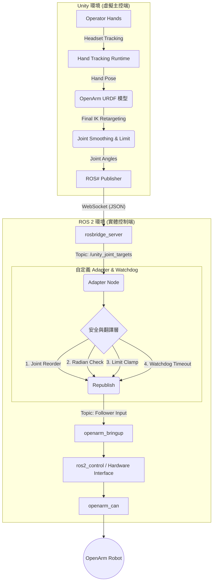

# OpenArm: Unity ↔ ROS 遙操作架構設計
> **Core Concept**: 
以 **Unity** 作為 Hand Tracking 與關節重定向 (Joint-level Retargeting) 的虛擬主控端，將解鎖出的關節命令透過 **ROS# (rosbridge)** 傳送至 **ROS 2**。
接著透過中間層 Adapter 轉發，交由 OpenArm 官方的 `ros2_control` 架構驅動實體機器人完成遠端操作 (Teleoperation)。

---

## 🏗️ 一、整體系統總覽

### 協作精神
- **Unity**：負責「人手狀態 → 機器人目標關節姿態」的映射轉換。
- **ROS Adapter**：充當「保險絲與翻譯層」，確保命令的安全性、有效性與防護。
- **ROS Control**：盡量不更動 OpenArm 官方 Stack，只負責穩定的「關節命令 → 硬體馬達驅動」。

### 架構圖

---

## 🎯 二、專案目標定義

目標:
完成**雙手 Tracking 控制雙支 OpenArm 手臂**：
1. 讀取手部追蹤姿態。
2. 在 Unity 內部以 **Final IK** 驅動虛擬 OpenArm 模型。
3. 抽取出各被動關節角度，經 **ROS#** 傳給 ROS 2。
4. 銜接至 OpenArm 現有的 Follower 控制機制。

加入**安全與穩定機制**：
1. **[Unity] Joint Limit Clamp**：限制關節角度，防止軟體端丟出超界數值。
2. **[ROS] Watchdog**：監控通訊頻率，若一段時間沒收到 Unity 指令，機器人必須 Hold 住或回到安全姿勢。
3. **[ROS] Startup Alignment**：Teleop 啟動之初，確保機器人的初始狀態能穩定過渡到 Unity 給予的首個目標姿態，防止爆衝。

---

## 💻 三、Unity 系統框架 (Upstream Controller)

Unity 在這裡扮演 **Virtual Leader Arm**，負責輸入處理與軌跡生成。

### 核心套件與角色分配
1. **Final IK**: 擔任核心的 Inverse Solvers，負責吸收 Hand Tracking 的動作並解算出 OpenArm 合理的對應關節移動。
2. **ROS#**: 提供 WebSocket 連線能力，將 `JointState` 或自定義命令打包推送給 `rosbridge`。
3. **RosSharpPublisher (自製)**: 專責管理 ROS 連線生命週期與 `joint target` Topic 的高頻率發布。
4. **TeleopUIManager (自製)**: 操作者介面，提供啟動/關閉遙控、以及重要的 **Emergency Stop (E-Stop)** 按鈕。

---

## 🤖 四、ROS 2 系統框架 (Downstream Follower)

ROS 將擔任嚴格的翻譯官與執行者。

### ROS 2 核心架構元件
- **`rosbridge_server`**: 收發 Unity WebSocket 訊息的首要門戶。
- **`openarm_ros2` Workspace**: 啟動 `openarm_bringup`、`ros2_control` 以及 `openarm_can` 硬體介面。
- **`Adapter Node` (安全用途)**: 接收來自 Unity 的資料，對joint command進行角度是否在馬達安全範圍內的驗證，並進行安全驗證，並且在該node啟動時，讓robot回到start pose。
- **`Watchdog Node`**: 監控 Heartbeat 與封包延遲，掉線即觸發 Fail-safe 機制，讓robot回到start pose。

### 控制資料流設計：Direct Joint Position Streaming
這是最直觀且效能負擔最低的方式：
> Hand Tracking ➡️ Unity Final IK 解算 ➡️ **傳送 Joint Angles (rad)** ➡️ ROS Adapter 驗證 ➡️ ros2_control 執行

---

## 🛡️ 五、Safety Framework (安全防護框架)

不論開發階段為何，以下安全層面必須實作：

### 1. Unity 軟體層保護
- **Tracking Valid Gate**: 失去追蹤時，立刻停止發送或發送「Hold」訊號。
- **Out-of-Workspace Reject**: 操作者手部超出合理範圍時忽略控制。

### 2. ROS Adapter 中介層保護
- **Limits & Velocity Clamp**: 硬性裁切過大或過快的指令。
- **Out-of-Workspace Reject**: 收到的joint command超出合理範圍時忽略控制。
- **Packet Timeout / Stale Reject**: 拒絕時間戳過期的延遲封包，防止機器人突然「瞬移」回憶過去的動作。